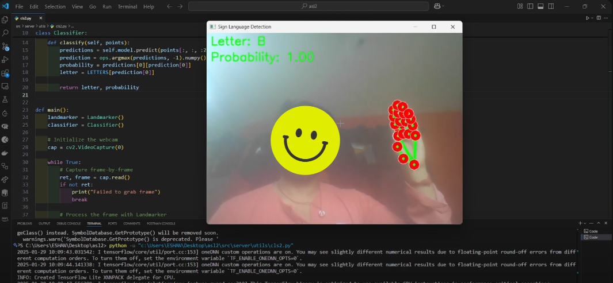

# Sign Language Detection
This project uses a webcam to detect hand landmarks and classify hand gestures into sign language letters using a pre-trained model.

## DEMO

[](https://youtu.be/yIHgsHTjNHc)

[Watch the demo video on YouTube](https://youtu.be/yIHgsHTjNHc)

## Requirements
- Python 3.x
- OpenCV
- TensorFlow
- MediaPipe

## Installation
1. Clone the repository:
    ```sh
    git clone https://github.com/Eshan276/sign_lang_Det.git
    cd sign_lang_Det
    ```

2. Install the required packages:
    ```sh
    pip install -r requirements.txt
    ```

3. Download the pre-trained model and place it in the [models] directory.

## Usage

1. Run the [cls2.py](https://github.com/Eshan276/sign_lang_Det/blob/main/cls2.py) script:
    ```sh
    python cls2.py
    ```

2. The webcam will start, and the program will detect hand landmarks and classify the hand gestures into sign language letters.

3. Press `q` to quit the program.

## Files

- [landmarker.py](https://github.com/Eshan276/sign_lang_Det/blob/main/landmarker.py): Contains the `Landmarker` class for detecting hand landmarks.
- [cls2.py](https://github.com/Eshan276/sign_lang_Det/blob/main/cls2.py): Contains the `Classifier` class for classifying hand gestures and the main script to run the program.
- [models](https://github.com/Eshan276/sign_lang_Det/blob/main/models): Directory containing the pre-trained models.
- [requirements.txt](https://github.com/Eshan276/sign_lang_Det/blob/main/requirements.txt): List of required packages.


## License

This project is licensed under the MIT License. See the LICENSE file for details.